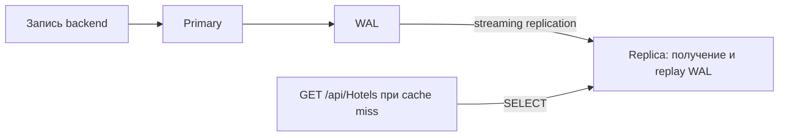

# Лабораторная работа №4 — Масштабирование чтения PostgreSQL: Primary + Replica

Работа выполнена по шести частям задания «Лабораторная работа №4. Масштабирование чтения PostgreSQL: Primary + Replica» для собственного сервиса HotelBooking. Стенд использует PostgreSQL **16.15**, физическую асинхронную streaming replication и существующий каталог **GET /api/Hotels**. Дата проверки — **14 сентября 2026 года**.

## Файлы и запуск

| Файл | Назначение |
|---|---|
| [docker-compose.yml](../docker-compose.yml) | Primary, Replica, два подключения backend и порядок запуска |
| [pg_hba.conf](../docker/postgres/pg_hba.conf) | Доступ к Primary, включая протокол репликации |
| [start-replica.sh](../docker/postgres/start-replica.sh) | Первоначальная копия через `pg_basebackup`, затем запуск standby |
| [016-configure-read-replica.sql](../liquibase/changelog/016-configure-read-replica.sql) | Роли, права чтения и физический слот репликации |
| [lab-04-read-scaling.sql](lab-04-read-scaling.sql) | SQL для ручной демонстрации частей 1–6 |
| [verify.py](lab-04/verify.py) | Автоматический эксперимент с SQL, HTTP, задержкой и восстановлением |
| [verification.jsonl](lab-04/results/verification.jsonl) | Фактические результаты всех этапов |
| [HotelBookingReadDbContext.cs](../HotelBooking/Data/HotelBookingReadDbContext.cs) | Отдельный контекст чтения |
| [HotelRepository.cs](../HotelBooking/Repositories/HotelRepository.cs) | Каталог читает Replica, операции записи используют Primary |

Из корня проекта:

```powershell
docker compose up -d --build
docker compose ps
```

Порядок запуска: Primary становится доступен → Liquibase применяет миграции, включая `016` → Replica получает начальную копию и запускается в recovery → запускается API. Существующий том `postgres_data` сохраняется; для Replica создан отдельный `postgres_replica_data`. При повторном старте готовая Replica использует свой том и продолжает replay, не копируя базу заново. Скрипт отказывается запускать экземпляр без `standby.signal` как Primary.

Для автоматической проверки нужен Python 3.10+ и psycopg 3. В использованной среде psycopg уже входит в pgAdmin; скрипт сам подключает его каталог DLL:

```powershell
$labPython = "$env:LOCALAPPDATA\Programs\pgAdmin 4\python\python.exe"
& $labPython docs/lab-04/verify.py
```

Для отдельно установленного Python:

```powershell
python -m pip install "psycopg[binary]>=3,<4"
python docs/lab-04/verify.py
```

Прогон создаёт один отель с уникальным City-маркером, выполняет проверки и удаляет только этот отель. В блоке `finally` возобновляется временно приостановленный replay. Не следует запускать несколько демонстраций паузы одновременно: пауза относится ко всей Replica. При принудительном завершении процесса вручную выполните на Replica `SELECT pg_wal_replay_resume();`.

SQL-файл выполняется **по блокам в двух подключениях**. Запускать его целиком на одном экземпляре нельзя: часть команд предназначена для Primary, часть — для Replica, а ошибка записи в части 4 ожидается.

## Часть 1. Поднять Primary и Replica

Сокращённый фрагмент итогового Compose; остальные параметры находятся в полном файле:

```yaml
services:
  postgres:
    build:
      context: ./docker/postgres
    image: hotelbooking-postgres-cron:16
    container_name: hotelbooking-postgres
    ports:
      - "5432:5432"
    volumes:
      - postgres_data:/var/lib/postgresql/data
      - ./docker/postgres/pg_hba.conf:/etc/postgresql/pg_hba.conf:ro

  postgres-replica:
    build:
      context: ./docker/postgres
    image: hotelbooking-postgres-cron:16
    container_name: hotelbooking-postgres-replica
    entrypoint: ["/bin/sh", "/opt/replication/start-replica.sh"]
    environment:
      PGDATA: /var/lib/postgresql/data
      PGPASSWORD: lab04_replication_password
    ports:
      - "127.0.0.1:5433:5432"
    volumes:
      - postgres_replica_data:/var/lib/postgresql/data
      - ./docker/postgres/start-replica.sh:/opt/replication/start-replica.sh:ro
    depends_on:
      liquibase:
        condition: service_completed_successfully
```

| Экземпляр | Контейнер | Подключение с компьютера | Подключение из Compose |
|---|---|---|---|
| Primary | `hotelbooking-postgres` | `localhost:5432` | `postgres:5432` |
| Replica | `hotelbooking-postgres-replica` | `localhost:5433` | `postgres-replica:5432` |

В обоих случаях база — `hotelbooking`. Для административной демонстрации: `hotelbooking_user` / `hotelbooking_password`. Для каталога: `hotelbooking_reader` / `lab04_reader_password`; роль имеет только `SELECT` на `public."Hotels"` и `public."Rooms"`.

Команды подключения:

```powershell
docker exec -it hotelbooking-postgres psql -X -U hotelbooking_user -d hotelbooking
docker exec -it hotelbooking-postgres-replica psql -X -U hotelbooking_user -d hotelbooking
```

Проверка на каждом экземпляре:

```sql
SELECT pg_is_in_recovery();
SHOW transaction_read_only;
```

| Проверка | Primary | Replica |
|---|---|---|
| `pg_is_in_recovery()` | `false` | `true` |
| `transaction_read_only` | `off` | `on` |

Оба контейнера имеют состояние `healthy`. Внутри обоих PostgreSQL порт равен 5432; внешний порт 5433 задаёт Docker, поэтому `inet_server_port()` не обязан показывать 5433. Вывод соединений сохранён в событии `1.roles` файла результатов.

## Часть 2. Настроить streaming replication

На Primary заданы `wal_level=replica`, `max_wal_senders=10`, `max_replication_slots=10`, `wal_keep_size=256MB`, `max_slot_wal_keep_size=1GB`. Миграция создаёт роль `hotelbooking_replicator` с атрибутами `LOGIN REPLICATION` и физический слот `hotelbooking_replica`.

В `pg_hba.conf` добавлено правило:

```text
host replication hotelbooking_replicator samenet scram-sha-256
```

Начальная копия создаётся командой из `start-replica.sh`:

```sh
pg_basebackup \
  --dbname='host=postgres port=5432 user=hotelbooking_replicator application_name=hotelbooking-replica' \
  --pgdata="$PGDATA" --wal-method=stream --checkpoint=fast \
  --slot=hotelbooking_replica --write-recovery-conf --progress --no-password
```

`--write-recovery-conf` (`-R`) создаёт `standby.signal` и записывает параметры подключения и слота в `postgresql.auto.conf`. Пароль берётся из окружения контейнера. [Документация pg_basebackup](https://www.postgresql.org/docs/16/app-pgbasebackup.html).

После базовой копии работает цепочка:



Primary формирует WAL для изменений, WAL sender передаёт поток на Replica, WAL receiver принимает его, а recovery воспроизводит изменения. Получение WAL и его применение — разные этапы. [Streaming replication PostgreSQL 16](https://www.postgresql.org/docs/16/warm-standby.html).

Требуемая заданием проверка выполнена на Primary:

```sql
SELECT * FROM pg_stat_replication;
```

Основные поля фактического результата:

```text
application_name       state       sync_state
hotelbooking-replica    streaming   async
```

Полная строка `pg_stat_replication` сохранена в событии `2.streaming`, рядом с `pg_stat_wal_receiver` на Replica. `synchronous_standby_names` пуст: Primary не ждёт подтверждения применения транзакции на Replica.

Слот удерживает необходимый Replica WAL в пределах настроенного ограничения. При длительном отключении и потере нужного WAL Replica может потребовать новой базовой копии. Лимит 1 GB ограничивает удержание WAL слотом; это не жёсткая квота всего каталога `pg_wal`. [Параметры репликации](https://www.postgresql.org/docs/16/runtime-config-replication.html).

Образ одинаковый на обоих экземплярах. Задания pg_cron из ЛР №3 выполняются на Primary; на Replica `shared_preload_libraries` пуст, повторного запуска этих заданий нет.

## Часть 3. Доказать, что репликация работает

Использована реальная таблица сервиса `public."Hotels"`. Автоматический сценарий выполняет INSERT на Primary в режиме autocommit:

```sql
INSERT INTO public."Hotels"
    ("Name", "Address", "City", "Country", "Description", "StarRating")
VALUES
    (:marker || ' v1', 'Laboratory address', :marker, 'Lab04', 'Read scaling fixture', 3)
RETURNING "Id", "Name", "City";
```

Здесь `:marker` — обозначение уникального маркера прогона; в Python используются параметры psycopg `%s`. После INSERT сразу выполняется на Replica:

```sql
SELECT "Id", "Name", "City" FROM public."Hotels" WHERE "Id" = :hotel_id;
```

В результатах `3.insert_primary_and_immediate_select` сохранены SQL, параметры, возвращённая Primary строка и первый SELECT на Replica. Событие `3.replication_proof` содержит ту же строку после проверки, что `pg_last_wal_replay_lsn()` достиг позиции WAL зафиксированной записи. Сравниваются все три поля, а не только факт наличия какого-либо отеля. Подключённая Replica подтверждена выводом части 2.

Фактический результат прогона в 09:32 UTC:

| Источник | Id | Name | City |
|---|---:|---|---|
| `INSERT ... RETURNING` на Primary | 2 | `Lab04-17a3757e293d v1` | `Lab04-17a3757e293d` |
| Первый `SELECT` на Replica | 2 | `Lab04-17a3757e293d v1` | `Lab04-17a3757e293d` |

Строка уже была видна при первом SELECT; сам SELECT занял **2.546 ms**. Проверенная позиция WAL после INSERT — `1/3400E198`.

## Часть 4. Проверить read-only поведение Replica

На Replica под административной ролью выполнено:

```sql
UPDATE public."Hotels"
SET "Name" = 'Replica write attempt'
WHERE "Id" = :hotel_id;
```

Полученный результат:

```text
SQLSTATE 25006
cannot execute UPDATE in a read-only transaction
```

Фактический ответ находится в `4.replica_write_rejected`. Проверка именно под администратором показывает ограничение standby, а не только нехватку привилегий роли чтения. Replica находится в recovery и воспроизводит WAL Primary; независимые изменения пользовательских таблиц несовместимы с этой ролью. Для её превращения в пишущий экземпляр нужен отдельный процесс promotion и переключения маршрутизации. В этой работе promotion не выполняется. [Hot Standby](https://www.postgresql.org/docs/16/hot-standby.html).

## Часть 5. Направить чтение собственного сервиса на Replica

Выбран существующий каталог с пагинацией и фильтрами `GET /api/Hotels`. Путь запроса:

```text
HotelsController.GetHotels
  → HotelService.GetHotelsPagedAsync
  → при отсутствии записи в Redis: HotelRepository.GetPagedAsync
  → HotelBookingReadDbContext → postgres-replica:5432
```

В [Program.cs](../HotelBooking/Program.cs) зарегистрированы два контекста с разными строками подключения:

```csharp
builder.Services.AddDbContext<HotelBookingDbContext>(options =>
    options.UseNpgsql(connectionString)); // DefaultConnection → Primary

builder.Services.AddDbContext<HotelBookingReadDbContext>(options =>
    options.UseNpgsql(readConnectionString)); // ReadConnection → Replica
```

В `HotelRepository.GetPagedAsync` исходный запрос теперь создаётся так:

```csharp
var queryable = _readContext.Hotels.AsNoTracking();
```

Через него выполняются и `COUNT`, и выборка страницы с `Rooms`. Контекст использует общую модель сущностей; его `SaveChanges` запрещён. В `ReadConnection` явно указан единственный адрес Replica, а роль `hotelbooking_reader` не имеет прав записи. Автоматического перехода на Primary при недоступности Replica нет. В Compose проверка здоровья Replica требует `pg_is_in_recovery() = true`.

`CreateAsync`, `UpdateAsync`, `DeleteAsync`, `GetByIdAsync` и `ExistsAsync` продолжают использовать `_context` с `DefaultConnection` на Primary. Репозитории бронирований, номеров, авторизации и Liquibase также подключены к Primary. Это сохраняет чтения, необходимые для операций изменения данных, на основном экземпляре.

HTTP-проверка сохранена в `5.backend_reads_replica`. Дополнительно на обоих экземплярах выполнено:

```sql
SELECT datname, usename, application_name, client_addr, state, query
FROM pg_stat_activity
WHERE application_name = 'hotelbooking-catalog-replica';
```

На Replica найдены соединения backend под `hotelbooking_reader` с SQL каталога; на Primary таких соединений нет. Проверка части 6 также подтверждает маршрут по данным: при остановленном replay API возвращает старое имя отеля, хотя Primary уже содержит новое.

Запрос `GET /api/Hotels?City=Lab04-17a3757e293d&Page=1&PageSize=21` вернул **HTTP 200**, `total=1`, `items[0].id=2`, `items[0].name="Lab04-17a3757e293d v1"`. На Replica зафиксировано соединение с `application_name=hotelbooking-catalog-replica` и адресом backend `172.18.0.4`; последний SQL выбирает `Hotels` с фильтром City, пагинацией и `LEFT JOIN Rooms`. На Primary результат поиска таких соединений — `[]`. Эти внутренние IP относятся к данному запуску Docker и могут измениться.

Существующий кэш каталога имеет TTL 5 минут. Для эксперимента каждый HTTP-запрос использует уникальный City прогона и другой `PageSize` (21, 22, 23), поэтому получает отдельный ключ Redis. Кэширование может сохранять старое значение дольше, чем сам replication lag; в обычной эксплуатации это нужно учитывать отдельно. Результат из кэша не доказывает обращение к БД.

## Часть 6. Понять replication lag

Сначала выполнен обычный эксперимент: после завершения INSERT на Primary сразу отправлен SELECT через заранее открытое соединение с Replica. Первый результат и длительность этого SELECT сохранены в `3.insert_primary_and_immediate_select`. Это длительность запроса, а не точное измерение replication lag; если строка уже видна, наблюдаемая задержка оказалась достаточно малой.

Для воспроизводимой демонстрации выполнен дополнительный управляемый эксперимент:

1. Replica догнала Primary, SQL и HTTP возвращают имя с `v1`.
2. На Replica вызван `pg_wal_replay_pause()`; проверено состояние `paused`.
3. Primary зафиксировал UPDATE имени на `v2`.
4. Прямой SELECT на Replica и новый HTTP-запрос каталога вернули `v1`.
5. Вызван `pg_wal_replay_resume()`; сценарий дождался нужной позиции replay LSN.
6. Replica и HTTP вернули `v2`.

Это **искусственная пауза применения WAL**, а не замер естественной сетевой задержки. WAL receiver при этом может продолжать получать WAL. Функции паузы и возобновления replay описаны в [документации PostgreSQL](https://www.postgresql.org/docs/16/functions-admin.html).

| Этап | Primary | SELECT на Replica | GET каталога с новым ключом кэша |
|---|---|---|---|
| До паузы | `v1` | `v1` | `v1` |
| Replay приостановлен, UPDATE завершён | `v2` | `v1` | `v1` |
| После возобновления и достижения LSN | `v2` | `v2` | `v2` |

Выводы подтверждаются событиями `6.controlled_lag` и `6.recovered`. Для диагностики сохранены receive/replay LSN и разница в байтах. Выражение `now() - pg_last_xact_replay_timestamp()` само по себе не равно текущему отставанию: при отсутствии новых транзакций возраст последней применённой транзакции растёт и на догнавшей Replica.

Во время паузы receive LSN был `1/3400F598`, replay LSN — `1/3400E1D0`: получено, но ещё не применено **5064 байта WAL**. Primary вернул `Lab04-17a3757e293d v2`, а SQL на Replica и HTTP с `PageSize=22` — `Lab04-17a3757e293d v1`. После resume и достижения `1/3400F598` HTTP с `PageSize=23` вернул `v2`. Все три HTTP-запроса завершились с кодом 200.

Асинхронная репликация не гарантирует немедленную видимость завершённой записи на другом экземпляре. Если после изменения обязательно нужно увидеть собственную запись, соответствующее чтение следует направить на Primary либо дождаться подтверждённого применения нужной позиции WAL. Автоматического failover и балансировки между несколькими Replica в данном стенде нет.

## Проверки

`dotnet test HotelBooking.Tests/HotelBooking.Tests.csproj --verbosity minimal`: **10 пройдено, 0 ошибок, 0 пропущено**. Отдельные тесты используют два независимых хранилища: запись и точечное чтение видят Primary, каталог ещё не видит эту запись; сохранение через контекст Replica отклоняется.

Автоматический интеграционный прогон проверяет реальные PostgreSQL и HTTP: роли узлов, `streaming`, перенос записи, SQLSTATE `25006`, соединения backend на Replica, старые данные при паузе, новые после replay, удаление своей тестовой записи и `/health`. Успех обозначается последним событием `verification_passed`; при нарушении проверки скрипт завершается с ненулевым кодом.

Фактический прогон завершился **успешно, exit code 0**, в `2026-09-14T09:32:06Z`. Итог: Primary, Replica и Redis — `Healthy`, replay — `not paused`, репликация — `streaming / async`. Тестовая запись Id=2 удалена с Primary, её удаление подтверждено на Replica. Файл результатов содержит 10 событий, включая HTTP-ответы и итоговое `verification_passed`.

При восстановлении NuGet выведены предупреждения об уязвимостях уже используемых пакетов AutoMapper, KubernetesClient и System.Security.Cryptography.Xml. Обновление этих зависимостей не входит в изменения ЛР №4; тесты завершились успешно.

## Контрольные вопросы

1. **Чем Primary отличается от Replica?** Primary принимает изменения; физическая Replica воспроизводит его WAL и обслуживает разрешённые запросы чтения в recovery.
2. **Почему запись выполняем на Primary?** Он является единственным источником изменений в этой топологии. Hot standby отклоняет INSERT, UPDATE и DELETE; отдельная запись на обоих узлах потребовала бы другой архитектуры и разрешения конфликтов.
3. **Как изменение из Primary попадает на Replica?** Через WAL: формирование на Primary → передача WAL sender → получение WAL receiver → replay на Replica.
4. **Что такое WAL в контексте репликации?** Write-Ahead Log — журнал, в котором PostgreSQL фиксирует необходимые для восстановления изменения до записи соответствующих страниц данных. Физическая репликация передаёт записи этого журнала, а не повторяет исходные SQL-команды клиента. [Надёжность и WAL](https://www.postgresql.org/docs/16/wal-intro.html).
5. **Что такое replication lag?** Отставание состояния Replica от Primary из-за времени формирования, передачи и применения изменений. В опыте с паузой отставало именно применение.
6. **Почему SELECT после INSERT может увидеть старые данные на Replica?** COMMIT на асинхронном Primary не ждёт replay на Replica. SELECT может выполниться до применения записи; в нашем управляемом опыте это показано для UPDATE.
7. **Что масштабируется при Read Scaling?** Способность обслуживать больше операций чтения за счёт распределения нагрузки по экземплярам. Один и тот же SQL не становится автоматически быстрее от появления Replica. Здесь проверена работоспособность маршрутизации, нагрузочный прирост QPS не измерялся.
8. **Почему Replica не отменяет индексы и оптимизацию SQL?** Каждый экземпляр всё равно выполняет план запроса и расходует CPU, память и I/O. Неудачный запрос остаётся дорогим и на Replica; физическая репликация переносит также индексы Primary.
9. **Расскажите про CAP-теорему.** C — согласованность в смысле линеаризуемого поведения единой копии; A — завершение запросов к исправным узлам; P — допущение сетевого разделения, при котором узлы не могут обмениваться сообщениями. Во время такого разделения нельзя гарантировать одновременно C и A для всех операций. Например, изолированная Replica может отвечать старым каталогом, сохраняя доступность чтения, но не строгую согласованность с новыми записями Primary. Если требовать актуального результата, придётся дождаться связи, обратиться к доступному Primary или отказать в операции — пожертвовать доступностью для части клиентов. Это не правило «всегда выбрать любые два из трёх» и не готовая классификация любого PostgreSQL как CP/AP: свойства зависят от маршрутизации, режима репликации и поведения при отказе. Пауза replay в работе показывает устаревшее чтение, но не является испытанием сетевого разделения. [Gilbert и Lynch, доказательство CAP](https://www.comp.nus.edu.sg/~gilbert/pubs/BrewersConjecture-SigAct.pdf).

## Что показать на защите

1. Два контейнера и разные внешние порты; `pg_is_in_recovery()` на обоих.
2. Строку `pg_stat_replication` со `streaming / async`.
3. INSERT на Primary и тот же Id на Replica.
4. Ошибку UPDATE на Replica.
5. `ReadConnection`, `GetPagedAsync` и соединение каталога в `pg_stat_activity` Replica.
6. Таблицу `v1 → v2`: Primary уже изменился, Replica и HTTP ещё показывают старое; после resume показывают новое.
7. Итоговое событие `verification_passed` и ответы на девять вопросов.
