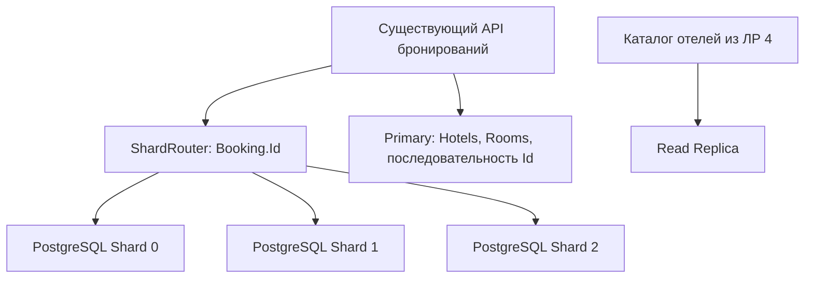

# Лабораторная работа №5 — Шардирование PostgreSQL: Router и Consistent Hashing

Работа выполнена по заданию «Шардирование PostgreSQL: Router и Consistent Hashing» внутри существующего backend **HotelBooking**. Использованы сущность `Booking`, таблица `public."Bookings"` и существующие HTTP-операции бронирования. На три независимых PostgreSQL загружено **100 000 бронирований**. Результаты записаны **14 сентября 2026 года**.

## Файлы и запуск

| Файл | Назначение |
|---|---|
| [docker-compose.yml](../docker-compose.yml), [docker-compose.shards.yml](../docker-compose.shards.yml) | Три PostgreSQL-шарда, подключения API и миграции |
| [001-bookings.sql](../liquibase/shards/001-bookings.sql) | Схема `Bookings`, индексы и сохранённая конфигурация маршрутизации |
| [ShardRouter.cs](../HotelBooking/Sharding/ShardRouter.cs) | Стабильный SHA-256, modulo и Consistent Hash Ring |
| [BookingShardStore.cs](../HotelBooking/Sharding/BookingShardStore.cs) | Соединения с шардами, чтение, запись и загрузка через COPY |
| [ShardedBookingRepository.cs](../HotelBooking/Repositories/ShardedBookingRepository.cs) | Реализация существующего `IBookingRepository` для шардов |
| [ShardingLab.cs](../HotelBooking/Sharding/ShardingLab.cs) | Импорт, загрузка, сравнение стратегий и проверки в сборке самого backend |
| [lab-05-sharding.sql](lab-05-sharding.sql) | Ручные запросы для pgAdmin |
| [run.py](lab-05/run.py) | Запуск экспериментов и проверка существующего HTTP API |
| [compare.json](lab-05/results/compare.json) | Количества записей, проценты переноса и точки кольца |
| [cluster-state.json](lab-05/results/cluster-state.json) | Независимые экземпляры PostgreSQL и сохранность данных после перезапуска |
| [verify.json](lab-05/results/verify.json), [http-verification.json](lab-05/results/http-verification.json) | Проверки репозиториев и HTTP |
| [import.json](lab-05/results/import.json), [seed.json](lab-05/results/seed.json) | Исходные данные и загрузка 100 000 бронирований |
| [unit-tests.txt](lab-05/results/unit-tests.txt) | Результат 21 теста |

Для уже подготовленного стенда открыть Docker Desktop и выполнить из корня проекта:

```powershell
docker compose up -d
docker compose ps
$labPython = "$env:LOCALAPPDATA\Programs\pgAdmin 4\python\python.exe"
& $labPython docs/lab-05/run.py
```

Python из pgAdmin содержит psycopg; скрипт подключает каталог его DLL автоматически. При использовании отдельного Python достаточно установить `python -m pip install "psycopg[binary]>=3,<4"` и заменить `& $labPython` на `python`.

Первичная подготовка на другом компьютере или при переходе с ЛР №4:

```powershell
docker compose up -d postgres redis postgres-replica liquibase-shard-0 liquibase-shard-1 liquibase-shard-2
docker compose build api
$labPython = "$env:LOCALAPPDATA\Programs\pgAdmin 4\python\python.exe"
& $labPython docs/lab-05/run.py --prepare
& $labPython docs/lab-05/run.py
```

`--prepare` останавливает API, импортирует существующие записи Primary через Router, загружает набор и запускает API с новым хранилищем. При ошибке подготовки API не запускается автоматически: нужно устранить ошибку импорта или загрузки. В нашем стенде исходная `public."Bookings"` была пустой: **sourceRows=0**, поэтому перенос старых записей не потребовался. Исходная таблица сохранена; новая запись сервиса направляется на шарды.

Набор из 100 000 записей сохраняется для защиты. Повторная полная загрузка уже готового набора пропускается; неполный набор требует проверки. Обычный запуск без `--prepare` не загружает данные повторно и удаляет только временные бронирования HTTP-проверки. Результаты команд перезаписываются новыми; Id временных записей при повторе могут отличаться. Для подготовки используется административный доступ только к локальному стенду. HTTP-тест создаёт краткоживущий JWT с ключом из локальных настроек разработки, не сохраняет токен и не отключает авторизацию API.

## 1. Выбор данных для шардирования

**Сущность — бронирование `Booking`, shard key — `Id`.** У бронирования сохраняются реальные поля сервиса: номер комнаты, имя и email гостя, даты заезда и выезда, количество гостей, цена и статус.

`Id` уникален и не меняется при редактировании брони. Клиент уже передаёт его в существующих маршрутах получения, изменения, отмены и удаления. Для этих операций Router может выбрать ровно один шард. Последовательные Id сначала хешируются, поэтому соседние номера не обязаны попадать на один сервер.

| Операция сервиса | Маршрутизация |
|---|---|
| `POST /api/Bookings` | Получить новый Id → вычислить шард → INSERT |
| `GET /api/Bookings/{id}` | SELECT на одном шарде |
| `PUT /api/Bookings/{id}` | Чтение и UPDATE на одном шарде |
| `POST /api/Bookings/{id}/cancel` | Изменить статус на одном шарде |
| `DELETE /api/Bookings/{id}` | DELETE на одном шарде |
| Список по номеру, email, общий список | Запросить все шарды и объединить результаты |
| Проверка занятости номера и статистика отеля | Прочитать нужные данные со всех шардов |

Для разнообразных Id ожидается близкое к равномерному распределение modulo. При этом одинаковое число строк не означает одинаковую нагрузку: отдельное бронирование может запрашиваться чаще остальных. Альтернативой был бы `RoomId`: он позволил бы проверять занятость комнаты на одном шарде, но запрос по одному `Booking.Id` потребовал бы знания RoomId или отдельного каталога размещения. В данной работе приоритет отдан существующим операциям по Id.

`Hotels` и `Rooms` остаются на Primary. Репозиторий получает бронирования со шардов, затем подгружает нужные комнаты и отели с Primary для существующего `BookingDto`. Новые Id выделяются прежней последовательностью `public."Bookings"` на Primary, поэтому локальные SERIAL на разных шардах не создают одинаковые Id. Это учебное решение сохраняет зависимость создания записей от Primary.

## 2. Запуск нескольких PostgreSQL

В основной Compose подключён [docker-compose.shards.yml](../docker-compose.shards.yml). В нём определены три независимых пишущих экземпляра с отдельными томами:

| Шард | Контейнер | С компьютера | Из backend в Compose |
|---|---|---|---|
| Shard 0 | `hotelbooking-shard-0` | `localhost:5434` | `postgres-shard-0:5432` |
| Shard 1 | `hotelbooking-shard-1` | `localhost:5435` | `postgres-shard-1:5432` |
| Shard 2 | `hotelbooking-shard-2` | `localhost:5436` | `postgres-shard-2:5432` |

База на каждом — `hotelbooking_shard`, пользователь — `hotelbooking_shard_user`, пароль локального стенда — `hotelbooking_shard_password`. Используется образ `postgres:16-alpine`. Внешние порты привязаны к localhost.

Фактически все три узла работают на **PostgreSQL 16.15**. Итоговая проверка после перезапуска Docker показала на каждом `pg_is_in_recovery()=false`, `transaction_read_only=off` и разные `system_identifier`: `7685404009289150498`, `7685404008627011618`, `7685404008381734946`. Значит, это независимые кластеры, а не физические реплики одного Primary. Количества строк сохранились: 33 219 / 33 353 / 33 428. Вывод записан в [cluster-state.json](lab-05/results/cluster-state.json); повторить только эту проверку можно командой `python docs/lab-05/run.py --inspect`.

Каждый шард получает свою схему через отдельный запуск Liquibase. Внутри каждого есть `public."Bookings"`, первичный ключ `Id`, индекс по email и составной индекс по комнате и датам. Первые запуски всех трёх миграторов завершились с **exit code 0**. В `sharding_layout` хранится отпечаток текущего правила маршрутизации; при запуске backend проверяет его на всех узлах.



Шарды хранят разные бронирования. Primary и Replica из четвёртой лабораторной — отдельная пара с копированием WAL; они не считаются двумя шардами. Каталог `GET /api/Hotels` по-прежнему использует Replica при отсутствии результата в Redis.

## 3. Реализация простого Router

В [Program.cs](../HotelBooking/Program.cs) при `Sharding:Enabled=true` существующий интерфейс `IBookingRepository` получает реализацию `ShardedBookingRepository`. Контроллер и сервис бронирований продолжают использовать прежние методы.

Правило активного Router:

```text
Id → десятичная строка без ведущих нулей → UTF-8 → SHA-256
   → первые 8 байт как unsigned UInt64 big-endian → % 3
```

В коде:

```csharp
public static ulong Hash(string value) => BinaryPrimitives.ReadUInt64BigEndian(
    SHA256.HashData(Encoding.UTF8.GetBytes(value)));

// В RouteHash для Modulo:
return _shards[(int)(hash % (ulong)_shards.Length)];
```

Используется `InvariantCulture`. Имена шардов сортируются с `StringComparer.Ordinal`, поэтому перестановка одинаковых подключений в конфигурации не меняет размещение. Хеш задан явно и не зависит от случайного seed процесса. Контрольный вектор: SHA-256 строки `"1"` начинается с `6B86B273FF34FCE1`.

Примеры из реально загруженных данных:

| Booking.Id | Шард |
|---:|---|
| 1, 2, 3 | Shard 1 |
| 5, 7, 13 | Shard 2 |
| 6, 8, 9 | Shard 0 |

При INSERT новый Id выделяется до вызова Router. GET/UPDATE/DELETE используют тот же алгоритм. `ReadAsync` с Id выбирает один узел; без Id выполняет запросы ко всем узлам и объединяет результаты. Значения фильтров передаются параметрами Dapper.

## 4. Распределение данных

Команда `dotnet HotelBooking.dll --lab05 seed` работает внутри сборки HotelBooking и использует собственную модель `Booking`, тот же `BookingShardStore` и тот же Router, что обычная HTTP-запись. Для пакетной загрузки используется PostgreSQL binary COPY по группам, выбранным Router. Отдельный учебный проект или искусственные таблицы users/orders не создавались.

Созданы один отель **Lab05 Sharding Hotel** (Id=4), 100 его комнат и 100 000 бронирований с Id **1–100 000**. В данных есть даты 2030–2035 годов, цена 200 за ночь, 90 000 подтверждённых и 10 000 отменённых бронирований. На каждую комнату приходится 1000 записей с разнесёнными датами. Данные синтетические, но соответствуют сущностям, таблицам и операциям самого HotelBooking.

Фактический `COUNT` набора на каждом PostgreSQL:

| Шард | Бронирований | Доля |
|---|---:|---:|
| Shard 0 | 33 219 | 33,219% |
| Shard 1 | 33 353 | 33,353% |
| Shard 2 | 33 428 | 33,428% |
| **Всего** | **100 000** | **100%** |

Разница между самым большим и самым маленьким шардом — **209 записей**, или 0,209% всего набора. Отклонение самого маленького от среднего 33 333,33 — около 0,343%. Заметного дисбаланса числа строк в modulo-раскладке нет. Это подтверждает равномерность для выбранных данных, но не измеряет CPU, I/O, частоту запросов или распределение размеров строк.

Команда сравнения читает Id непосредственно из трёх PostgreSQL, проверяет уникальность Id между узлами и соответствие каждой записи активному Router. JSON с результатом — [compare.json](lab-05/results/compare.json).

## 5. Добавление нового шарда: modulo, 3 → 4

Для **тех же 100 000 Id, прочитанных из базы**, вычислены старое и новое размещения:

```text
old = hash(Id) % 3
new = hash(Id) % 4
moved = количество Id, для которых old != new
```

| Результат | Записей |
|---|---:|
| Изменили шард | **74 969** |
| Остались на прежнем | **25 031** |
| Из перемещаемых: направлены на новый Shard 3 | 25 147 |
| Из перемещаемых: переходят между старыми шардами | 49 822 |

Процент переноса: **74 969 / 100 000 × 100% = 74,969%**.

Изменение делителя меняет остатки для большинства хешей. Поэтому добавление одного PostgreSQL требует не только наполнить новый узел: при modulo почти 50 тысяч записей в нашем наборе ещё и меняют владельца между старыми узлами. Новое рассчитанное распределение: **25 014 / 24 868 / 24 971 / 25 147**.

Как предложено в задании («представьте, что добавляется ещё один экземпляр»), этап 3 → 4 — **расчёт требуемого переноса**, а не физическая миграция данных. Три реально работающих шарда продолжают обслуживать API по исходной схеме. Четвёртый PostgreSQL для такого сравнения не запускался.

## 6. Реализация Consistent Hashing

В том же `ShardRouter` реализована стратегия `ConsistentHash`. Id хешируется той же функцией, узлы получают точки по хешу строк `shard-0:0`, `shard-1:0`, `shard-2:0`. Точки сортируются; владелец ключа — первая точка с позицией **не меньше** хеша ключа. Если такой точки нет, поиск переходит к первой точке кольца.

Поиск реализован двоичным поиском. Базовый вариант содержит одну точку на физический шард. Точное попадание в точку принадлежит этой точке, а переход через конец кольца проверен тестами.

Позиции базового кольца (hex, возрастающий порядок):

| Узел | Позиция |
|---|---|
| Shard 1 | `28585A5647107643` |
| Shard 2 | `47AFA04D222D2283` |
| Новый Shard 3 | `C0FCA27CDF31036E` |
| Shard 0 | `F979E40276AF1D28` |

До добавления Shard 3 весь интервал от Shard 2 до Shard 0 обслуживал Shard 0. Новая точка забирает часть этого интервала. Положения старых точек сохраняются. Для этих имён новый интервал занимает примерно 47,38% кольца, поэтому реальный перенос близок к 47%, а не к 25%.

Такое сохранение размещения вне изменившихся интервалов — основная идея consistent hashing. [Оригинальная работа Karger и соавторов](https://people.csail.mit.edu/karger/Papers/web.pdf).

## 7. Сравнение стратегий

Результаты расчёта на одном наборе Id:

| Стратегия | Требуют переноса | Остаются | Перенос, % | Перенос между старыми узлами |
|---|---:|---:|---:|---:|
| `hash(Id) % N` | **74 969** | 25 031 | **74,969%** | 49 822 |
| Consistent Hashing, одна точка на шард | **47 324** | 52 676 | **47,324%** | **0** |
| Дополнительно: Consistent Hashing, 128 virtual nodes | **23 669** | 76 331 | **23,669%** | **0** |

**Почему результаты отличаются?** Modulo меняет делитель для каждого хеша; кольцо добавляет точки, сохраняя прежние точки и владельцев остальных интервалов. В обоих вариантах Consistent Hashing все изменившие владельца записи направлены только на новый Shard 3. Это свойство проверяется программно.

**Почему базовое кольцо переносит 47%, а не 25%?** Одна случайная точка на узел не делит кольцо на равные части. До добавления узла расчётное распределение было **69 500 / 18 273 / 12 227**, после — **22 176 / 18 273 / 12 227 / 47 324**. Базовый алгоритм уменьшил перенос по сравнению с modulo, но дал сильный дисбаланс. Эти количества относятся к рассчитанной раскладке кольца; физически сохранена modulo-раскладка из части 4.

**Virtual nodes.** Дополнительно реализованы 128 точек для каждого физического сервера: `shard-0:0` … `shard-0:127` и аналогично для остальных. Один сервер владеет множеством небольших интервалов. Для нашего набора распределение на трёх узлах стало **34 824 / 29 901 / 35 275**, на четырёх — **25 565 / 24 623 / 26 143 / 23 669**. Баланс заметно лучше базового кольца; идеальное равенство не достигнуто и не гарантируется.

**Добавление ещё одного шарда, 4 → 5:**

| Стратегия | Изменили владельца |
|---|---:|
| Modulo | 79 651 — 79,651% |
| Базовое кольцо | 4 074 — 4,074% |
| 128 virtual nodes | 18 613 — 18,613% |

Малые 4,074% у базового кольца связаны с небольшим новым интервалом для имени `shard-4`; это не универсальный процент и не признак хорошего баланса нагрузки.

**Удаление Shard 1 из четырёх узлов:**

| Стратегия | Изменили владельца |
|---|---:|
| Modulo | 74 835 — 74,835% |
| Базовое кольцо | 18 273 — 18,273% |
| 128 virtual nodes | 24 623 — 24,623% |

На кольце меняют владельца только ключи удалённого сервера; они переходят следующим точкам по кольцу. При плановом удалении нужно успеть перенести записи. Если сервер с единственной копией данных потерян, один Router не восстановит его данные — нужны резервные копии или репликация.

Активный API в этой работе использует **Modulo с тремя шардами**; обе версии кольца реализованы в backend и проверены на тех же реальных Id. Простая смена `Strategy`, `VirtualNodes` или количества узлов без переноса данных запрещается проверкой `sharding_layout`. Для реального переключения нужны план миграции, перенос записей, проверка полноты и согласованное обновление размещения и конфигурации. Физическая миграция при изменении топологии не входит в требуемый эксперимент.

## Проверка существующего backend

В [http-verification.json](lab-05/results/http-verification.json) сохранены **23 HTTP-запроса** с ответами. Созданы четыре временных бронирования:

| Id | Router выбрал | Где найдена запись прямым SQL | Есть на Primary |
|---:|---|---|---|
| 100 001 | Shard 1 | Только Shard 1 | Нет |
| 100 002 | Shard 0 | Только Shard 0 | Нет |
| 100 003 | Shard 0 | Только Shard 0 | Нет |
| 100 004 | Shard 2 | Только Shard 2 | Нет |

POST вернул 201, чтение и изменение — 200; обновлённое имя вернулось последующим GET. Проверены поиск по email через все шарды, исключение занятой комнаты из поиска, отмена брони и новый статус `Cancelled`. DELETE вернул 204, последующий GET — 404. Все четыре временные записи удалены. Набор из 100 000 бронирований сохранён.

Отдельная проверка через реальные репозитории подтвердила **100 000 бронирований**, общую сумму **20 000 000**, 90 000 `Confirmed` и 10 000 `Cancelled`. Общая сумма включает отменённые записи согласно прежнему определению `TotalRevenue`; помесячный доход исключает отменённые. Проверены занятость комнаты, исключение редактируемой брони из проверки, поиск свободных комнат и запрет удаления комнаты/отеля с бронированиями на шардах. Результат — [verify.json](lab-05/results/verify.json), `passed=true`.

`dotnet test`: **21 пройдено, 0 ошибок**. Тесты проверяют стабильный вектор SHA-256, перестановку конфигурации, unsigned modulo, равенство на границе и переход через конец кольца, добавление и удаление узлов, некорректные параметры. Сохранились тесты разделения чтения/записи из ЛР №4.

## Особенности и ограничения реализации

`Booking.Id` — единственный ключ размещения. Поэтому запросы по `RoomId`/email и отчётность обращаются ко всем шардам. Для статистики отеля сначала выбираются его комнаты с Primary, затем бронирования фильтруются на шардах; текущая реализация агрегирует выбранные записи в backend. Это функциональная реализация для лабораторной, без измерения масштабирования QPS и без распределённого согласованного снимка.

PostgreSQL не обеспечивает внешний ключ из таблицы на одном независимом экземпляре к `Rooms` на другом. Проверка наличия комнаты выполняется сервисом, удаление родителей с бронированиями проверяется репозиториями. Эти проверки не являются распределённой транзакцией: параллельные операции бронирования и удаления требуют дополнительной координации для строгих гарантий. Проверка доступности и INSERT также не атомарны между шардами; конкурентное бронирование одного номера — отдельная задача.

Primary остаётся источником справочников и глобальных Id. У каждого шарда в этом стенде одна копия данных; отказ шарда не означает автоматический переход на другой. Реплика из ЛР №4 копирует Primary, а не три новых шарда. Индексы всё ещё необходимы на каждом узле.

Для совместимости существующей модели `Booking` с Dapper поля PostgreSQL DATE при чтении приводятся к timestamp: модель использует `DateTime`, а Npgsql может выдавать DATE как `DateOnly`. В таблице сами даты остаются DATE. [Документация Npgsql о датах](https://www.npgsql.org/doc/types/datetime.html).

## 8. Итог — 8 предложений

Шард — независимый экземпляр PostgreSQL, хранящий часть бронирований сервиса. Shard key определяет, на каком узле расположена запись; в работе выбран неизменяемый `Booking.Id`. Router вычисляет этот узел одинаково для записи и последующего чтения. Стратегия `hash(Id) % N` дала близкое к равномерному распределение 100 000 бронирований между тремя шардами. Однако изменение N с трёх на четыре потребовало бы переноса 74,969% записей. Consistent Hashing сохраняет положения старых узлов и меняет владельцев только в интервалах новых точек. Базовое кольцо уменьшило перенос до 47,324%, но выявило дисбаланс, а 128 виртуальных узлов улучшили распределение и сократили перенос до 23,669%. Для сервиса с изменяющимся числом шардов я выбрал бы Consistent Hashing с виртуальными узлами и явным механизмом миграции, учитывая стоимость запросов без shard key и необходимость защиты конкурентных операций.

## Вопросы для самопроверки

1. **Что такое shard?** Отдельный узел хранения с частью общего набора данных. В работе каждый из трёх PostgreSQL хранит свою часть `Bookings`.
2. **Что такое shard key?** Поле, по которому Router определяет размещение записи. Здесь это `Id` бронирования.
3. **Почему нельзя просто случайно распределять записи?** Последующее чтение должно находить нужный узел. При независимом случайном выборе пришлось бы опрашивать все серверы или хранить отдельный каталог размещения. Детерминированный Router вычисляет тот же ответ по ключу.
4. **Как работает `hash(key) % N`?** Стабильный хеш ключа преобразуется в число, остаток от деления на количество узлов выбирает индекс шарда.
5. **Почему изменение количества шардов — проблема?** Меняется правило размещения существующих ключей. Данные нужно перенести до использования новой маршрутизации, иначе запрос попадёт на узел, где записи ещё нет.
6. **Что такое Consistent Hash Ring?** Упорядоченное пространство хешей, замкнутое в кольцо, с точками серверов и правилом выбора ближайшего сервера по часовой стрелке.
7. **Почему при добавлении шарда не нужно переносить все данные?** Новые точки забирают только свои интервалы у прежних владельцев; остальные точки и назначения сохраняются.
8. **Что такое virtual nodes?** Несколько точек одного физического сервера на кольце. Они разбивают его владение на небольшие интервалы и обычно улучшают баланс и распределение переносимых данных.
9. **Гарантирует ли Consistent Hashing идеальное распределение нагрузки?** Нет. Положения точек случайны, объёмы записей и частоты обращений различаются. В работе даже 128 точек не дали строго равных количеств строк.
10. **Что произойдёт при значительно большей нагрузке на один шард?** Его задержки и очереди могут ограничить работу сервиса. Нужно измерить причину: перекос ключей, крупные записи, горячие ключи или дорогие SQL. Возможны оптимизация запросов, кэширование, добавление ресурсов/реплик для чтения, перенос части интервалов или изменение ключа. Добавление виртуальных узлов само по себе не разделит один горячий ключ.

## Что показать на защите

1. Три PostgreSQL и `COUNT(*)` на каждом: 33 219 / 33 353 / 33 428.
2. Выбор `Bookings.Id`, `ShardRouter.RouteHash` и подключение `ShardedBookingRepository` в `Program.cs`.
3. Пример `Id=6` на Shard 0, `Id=1` на Shard 1 и `Id=5` на Shard 2.
4. `docker exec hotelbooking-api dotnet HotelBooking.dll --lab05 compare` и таблицу процентов переноса.
5. Базовое кольцо, его дисбаланс и дополнительный результат с virtual nodes.
6. Успешные HTTP-запросы и ответы на десять вопросов.
