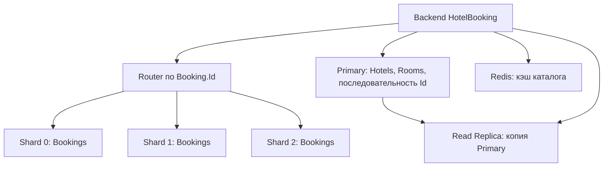

# Лабораторная работа №6 — Запросы и архитектура после шардирования

Работа выполнена по заданию «Что происходит с backend-сервисом после шардирования» на существующем **HotelBooking**. Анализируются реальные репозитории и HTTP endpoint’ы после ЛР №5. Эксперименты выполнены **16 сентября 2026 года** на сохранённых **100 000 бронирований**. Схема данных, маршрутизация и поведение backend не изменялись.

## Файлы и воспроизведение

| Файл | Назначение |
|---|---|
| [run.py](lab-06/run.py) | Проверка маршрутизации, агрегации, JOIN, top-100, нагрузки и отказа |
| [lab-06-after-sharding.sql](lab-06-after-sharding.sql) | Запросы для отдельных подключений pgAdmin |
| [queries.json](lab-06/results/queries.json) | Фактические результаты, план запроса и все замеры времени |
| [failure.json](lab-06/results/failure.json) | HTTP до отказа, во время отказа и после восстановления |
| [sql-verification.json](lab-06/results/sql-verification.json) | Отдельная проверка 10 запросов ручного SQL-сценария на нужных узлах |
| [Отчёт ЛР №5](lab-05-sharding-report.md) | Подготовка набора данных и исходная архитектура |

Для уже подготовленного стенда открыть Docker Desktop и выполнить из корня проекта:

```powershell
docker compose up -d
$labPython = "$env:LOCALAPPDATA\Programs\pgAdmin 4\python\python.exe"
& $labPython docs/lab-06/run.py

# Дополнительно: реальная остановка shard-2 и восстановление в finally.
& $labPython docs/lab-06/run.py --with-failure
```

Для отдельного Python нужен `psycopg` 3: `python -m pip install "psycopg[binary]>=3,<4"`. Если данные ЛР №5 ещё не подготовлены, сначала выполнить её инструкции. Скрипт №6 не создаёт и не перезаписывает бронирования. Он проверяет существующий modulo layout и 100 000 уникальных записей отеля `Lab05 Sharding Hotel`, читает настройки подключений из `HotelBooking/appsettings.json` и открывает SQL-соединения в режиме только чтения.

Обычный запуск перезаписывает `queries.json`. Флаг `--with-failure` также перезаписывает `failure.json`: на короткое время часть API будет недоступна. Контейнер запускается обратно в `finally`; если процесс принудительно завершён извне, восстановить вручную: `docker start hotelbooking-shard-2`. Перед остановкой все девять HTTP-проверок должны пройти. После восстановления повторяются запросы и проверяется сохранность количества записей. JWT краткоживущий, использует локальные настройки разработки и не сохраняется в результатах.

Денежные значения в JSON записаны строками для сохранения точности `numeric`/`Decimal`. Время при повторном запуске изменится. Во время сравнения результатов не следует параллельно редактировать учебный набор: общего снимка данных сразу трёх независимых PostgreSQL здесь нет.

## 1. Архитектура после ЛР №5



| Узел | Порт с компьютера | Данные |
|---|---|---|
| Primary | 5432 | Отели, комнаты, пользователи, последовательность Id, исходная `Bookings` |
| Read Replica | 5433 | Копия Primary, чтение каталога |
| Shard 0 | 5434 | 33 219 бронирований |
| Shard 1 | 5435 | 33 353 бронирования |
| Shard 2 | 5436 | 33 428 бронирований |

Шарды — независимые PostgreSQL, каждый хранит свою часть `Bookings`. Реплика Primary не содержит данные этих шардов. Исходная `Bookings` на Primary в проверенном стенде пуста и не служит общей таблицей поверх шардов.

В [ShardRouter.cs](../HotelBooking/Sharding/ShardRouter.cs) действует правило:

```text
SHA-256(UTF-8 десятичного Booking.Id)
→ первые 8 байт как unsigned UInt64 big-endian
→ остаток от деления на 3
```

`BookingShardStore.ReadAsync` и `AnyAsync` выбирают один шард, если передан `id`; иначе обращаются ко всем через `Task.WhenAll`. [ShardedBookingRepository](../HotelBooking/Repositories/ShardedBookingRepository.cs) реализует существующий `IBookingRepository`.

## 2. Single-shard query

Реальный пример — `GET /api/Bookings/5`:

```text
BookingsController.GetBooking(5)
→ BookingService.GetBookingByIdAsync(5)
→ ShardedBookingRepository.GetByIdAsync(5)
→ Router.Route(5) = shard-2
```

Запрос к бронированиям:

```sql
SELECT * FROM public."Bookings" WHERE "Id" = 5;
```

В репозитории перечислены столбцы, а даты приводятся к `timestamp` для совместимости с `DateTime`; условие маршрутизации то же. Id однозначно определяет место хранения, поэтому проверять остальные шарды не нужно. Фактический `EXPLAIN (ANALYZE, BUFFERS)` показал **Index Scan по `Bookings_pkey`**, одну строку и **Execution Time 0,181 мс**. План сохранён в `queries.json → singleShard.plan`.

**Запрос к `Bookings` выполняется на одном шарде, но полный HTTP-запрос дополнительно читает Primary.** Метод `WithRoomsAsync` загружает комнату и отель для `BookingDto`. Поэтому наличие single-shard SQL ещё не означает независимость endpoint’а от всех остальных баз. HTTP в первом прогоне занял 1362,394 мс: в него входят запуск соединений, код приложения, загрузка справочников и сеть; сравнивать это число напрямую с SQL Execution Time нельзя.

По одному шарду также выполняются `ExistsAsync(id)`, непосредственные INSERT/UPDATE/DELETE бронирования. Создание брони как бизнес-операция сложнее: перед INSERT сервис проверяет занятость комнаты **на всех шардах**, а новый Id получает на Primary.

## 3. Агрегация по всем шардам

### Реальный запрос сервиса

[BookingReportRepository.GetBookingStatisticsAsync](../HotelBooking/Repositories/BookingReportRepository.cs) считает количество, выручку, среднюю стоимость, брони по статусам и выручку по месяцам для отеля и дат. Это метод репозитория; отдельного HTTP endpoint’а статистики в текущем проекте нет.

В шардированной ветке сейчас выполняются три шага:

1. Получить Id комнат отеля с Primary.
2. Прочитать подходящие бронирования со всех шардов через `ReadAsync`.
3. Выполнить `Count`, `Sum`, `Average`, `GroupBy` в памяти backend.

Это даёт полный результат, но передаёт в приложение все подходящие строки и сортирует их по Id внутри `ReadAsync`, хотя для статистики такая сортировка не нужна. При росте данных увеличиваются сетевой трафик и потребление памяти.

### Эксперимент с частичными итогами

`run.py` использует те же комнаты отеля и включительный диапазон дат 2030-01-01…2040-01-01, но считает частичные итоги непосредственно на каждом PostgreSQL:

```sql
SELECT "Status", count(*) AS n, sum("TotalPrice") AS total
FROM public."Bookings"
WHERE "RoomId" = ANY(@RoomIds)
  AND "CheckInDate" >= @StartDate::date
  AND "CheckInDate" <= @EndDate::date
GROUP BY "Status";
```

| Шард | COUNT | SUM TotalPrice | Confirmed | Cancelled |
|---|---:|---:|---:|---:|
| 0 | 33 219 | 6 643 800 | 29 762 | 3 457 |
| 1 | 33 353 | 6 670 600 | 30 064 | 3 289 |
| 2 | 33 428 | 6 685 600 | 30 174 | 3 254 |
| **Общий итог** | **100 000** | **20 000 000** | **90 000** | **10 000** |

Для этих итогов переданы **6 строк**: два статуса с каждого шарда. Выручка по месяцам вычисляется отдельным запросом и требует дополнительных строк. Результат всех групп, сумм и помесячных значений автоматически сопоставлен с независимым расчётом по полной выборке 100 000 строк. В проверочном скрипте полная выборка нужна как эталон; оптимизация в рабочий репозиторий в рамках этой аналитической работы не вносилась.

Правила объединения на backend:

```text
COUNT = сумма локальных COUNT
SUM = сумма локальных SUM
AVG = сумма локальных SUM / сумма локальных COUNT
GROUP BY Status = объединение одинаковых статусов с суммированием итогов
GROUP BY Month = объединение одинаковых месяцев с суммированием выручки
```

Для nullable-поля знаменателем AVG должен быть `COUNT(поле)`, а не число всех строк. `TotalPrice` в текущей схеме NOT NULL. При пустой выборке сервис возвращает среднее 0; SQL `AVG` без строк даёт NULL. Поведение агрегатных функций описано в [документации PostgreSQL](https://www.postgresql.org/docs/16/functions-aggregate.html).

Усреднять средние шардов нельзя: условный шард с одной ценой 10 и шард с тремя ценами по 30 дадут `(10 + 30) / 2 = 20`, хотя правильное среднее `(10 + 90) / 4 = 25`. В текущем наборе каждая бронь стоит 200, поэтому подобная ошибка скрылась бы за одинаковыми локальными AVG. SQL-файл содержит отдельный контрпример.

Общая выручка соответствует действующему репозиторию и **включает отменённые бронирования**. Помесячная выручка отменённые исключает; её общий итог — **18 000 000**. Это две разные метрики, их нельзя смешивать.

### Ответы на вопросы об агрегации и времени

1. **На одном шарде весь отчёт не получить:** бронирования комнат отеля распределены по Booking.Id. Один узел вернёт только часть.
2. **Объединять результаты должен backend** либо выделенный координатор/аналитическое хранилище. Сам Router выбирает адреса, но не заменяет агрегацию.
3. **Больше шардов не гарантирует меньшую задержку.** При последовательных запросах приблизительно складываются времена узлов. При параллельных результат зависит от самого медленного узла, плюс передача и объединение. Растут число соединений, объём координации и вероятность ожидания медленного или отказавшего узла.

Фактические медианы пяти прогретых прогонов частичной агрегации:

| Запрошено шардов | Покрыто бронирований | Последовательно, мс | Параллельно, мс |
|---:|---:|---:|---:|
| 1 | 33 219 | 38,383 | 45,521 |
| 2 | 66 572 | 83,137 | 55,880 |
| 3 | 100 000 | 138,534 | 75,212 |

Измерено время Python-клиента, включая создание соединений, выполнение SQL, передачу результата, создание пула потоков и подсчёт общего COUNT. Перед пятью измерениями каждого режима выполнен один прогрев. При 1/2/3 узлах запрашиваются разные части существующего набора, а не один и тот же набор после перераспределения. Все контейнеры работают на одном компьютере. Таблица показывает стоимость обхода узлов в этом стенде; она не доказывает линейное масштабирование или конкретную производительность боевого backend. Все отдельные замеры сохранены в JSON.

## 4. JOIN между узлами

Реальная связь: **`Bookings.RoomId → Rooms.Id → Hotels.Id`**. До шардирования `BookingReportRepository` мог использовать локальный JOIN `Bookings` с `Rooms`. После шардирования бронирование находится на одном из трёх узлов, а комната и отель — на Primary.

Попытка выполнить на shard-2 обычный запрос:

```sql
SELECT b."Id", r."RoomNumber"
FROM public."Bookings" b
JOIN public."Rooms" r ON r."Id" = b."RoomId"
LIMIT 1;
```

завершилась **SQLSTATE 42P01: `relation "public.Rooms" does not exist`**. Результат сохранён в `queries.json → join`. На Primary такой JOIN синтаксически возможен, но читает старую локальную `Bookings`, где сейчас 0 строк, и не видит 100 000 бронирований на других PostgreSQL.

Один обычный SQL-запрос к независимому PostgreSQL не получает таблицы других серверов автоматически. Для этого нужны настроенные внешние таблицы, например [postgres_fdw](https://www.postgresql.org/docs/16/postgres-fdw.html), либо распределённый движок. В этом проекте они не настроены.

### Как связь собирается сейчас

`ShardedBookingRepository.WithRoomsAsync` объединяет данные в приложении:

1. Получает бронирования с нужных шардов.
2. Собирает уникальные `RoomId`.
3. Одним запросом EF Core к Primary загружает комнаты с отелями через `Include(r => r.Hotel)`.
4. Создаёт словарь комнат и присоединяет подходящую комнату к каждой брони.

В проверенном наборе **100 000 бронирований связаны со 100 комнатами**. Например, бронь **Id=5** на shard-2 относится к **RoomId=5**, номер **L05-004**, отель **Lab05 Sharding Hotel** на Primary. Скрипт проверил наличие комнаты для каждой брони; HTTP подтвердил правильное имя отеля.

Между узлами требуется передать ключи связи, подходящие бронирования и нужные поля комнат/отелей. В текущей реализации данные идут через backend, прямого обмена между PostgreSQL-шардами нет. Фильтрация и проекция до передачи сокращают объём, а получение комнат пачкой устраняет запрос к Primary на каждую отдельную бронь. Однако это всё ещё несколько чтений без единой транзакции между серверами.

### Можно ли улучшить JOIN выбором ключа

`RoomId` позволил бы хранить брони одной комнаты вместе; для локального JOIN на том же шарде должна находиться и сама комната. `HotelId` позволил бы совместно размещать отель, его комнаты и брони. **Одна смена хешируемого поля без переноса связанных таблиц локальным JOIN не делает.**

Альтернатива — копировать небольшой справочник комнат на каждый шард, но тогда нужны обновление копий и понятная политика устаревания. И у размещения по RoomId, и у размещения по HotelId есть цена: поиск только по Booking.Id больше не определяет шард без дополнительного ключа или каталога размещения.

## 5. ORDER BY + LIMIT

### Существующий запрос

В [HotelRepository.GetPagedAsync](../HotelBooking/Repositories/HotelRepository.cs) для `GET /api/Hotels` используется:

```csharp
.OrderBy(h => h.Name)
.Skip((query.Page - 1) * query.PageSize)
.Take(query.PageSize)
```

Это выбор страницы через `ORDER BY`, `OFFSET`, `LIMIT`. **Hotels сейчас не шардированы**: при промахе Redis запрос выполняется на Read Replica. Поэтому текущему каталогу merge трёх шардов не нужен. При одинаковых названиях для устойчивого порядка полезно добавить Id как второй ключ; в действующем коде этого пока нет.

`GET /api/Bookings` сейчас возвращает весь список и не имеет LIMIT. Чтобы проверить распределённый top-N на реально шардированных данных, в SQL и скрипте выполнен **отдельный эксперимент** с бронированиями:

```sql
SELECT "Id", "RoomId", "CheckInDate", "TotalPrice"
FROM public."Bookings"
WHERE ... -- одинаковый фильтр отеля и дат на каждом шарде
ORDER BY "CheckInDate" DESC, "Id" DESC
LIMIT 100;
```

1. Каждый шард вернул локальные первые 100 строк.
2. Координатор получил 300 кандидатов.
3. Объединил их с тем же порядком и выбрал глобальные 100.
4. Сравнил результат с полной сортировкой всех 100 000 подходящих строк: **результаты совпали**.

| Шард | Строк в общем top-100 | Сколько правильных строк потеряем при чтении только этого шарда |
|---|---:|---:|
| 0 | 41 | 59 |
| 1 | 34 | 66 |
| 2 | 25 | 75 |

Первые 100 на одном узле ничего не говорят о более подходящих строках на других. При этом брать больше локальных 100 для глобальных 100 без OFFSET не требуется: строка ниже сотой на собственном шарде уже имеет перед собой минимум 100 строк и в общий top-100 не попадёт. Доказательство предполагает одинаковые фильтры, общий полный порядок и отсутствие дополнительной дедупликации. Здесь Id глобально уникален.

Второй ключ `Id` устраняет неопределённость при совпадающих датах. Требование определённого порядка при LIMIT описано в [документации PostgreSQL](https://www.postgresql.org/docs/16/queries-limit.html).

Для страницы с OFFSET=K каждый шард в общем случае должен предоставить до K+N кандидатов; применять OFFSET отдельно на каждом шарде неправильно. Глубокие страницы становятся дорогими. Практический вариант — пагинация по последней паре `(CheckInDate, Id)`, затем merge следующей порции. Это предложение для развития API, а не уже реализованный endpoint.

## 6. Отказ одного шарда

### Фактический эксперимент

Скрипт проверил работающий API, остановил **только `hotelbooking-shard-2`**, повторил запросы, затем запустил контейнер и повторил проверки. Данные и тома не удалялись. Полные статусы и времена находятся в `failure.json`.

| Запрос | До | Shard 2 остановлен | После |
|---|---:|---:|---:|
| `GET /api/Bookings/6` → shard-0 | 200 | **200** | 200 |
| `GET /api/Bookings/1` → shard-1 | 200 | **200** | 200 |
| `GET /api/Bookings/5` → shard-2 | 200 | **500** | 200 |
| `GET /api/Bookings` | 200 | **500** | 200 |
| `GET /api/Bookings/room/1` | 200 | **500** | 200 |
| `GET /api/Bookings/guest/lab05.booking.000001%40example.test` | 200 | **500** | 200 |
| `GET /api/Rooms/available?hotelId=4&checkIn=2030-01-01&checkOut=2030-01-02` | 200 | **500** | 200 |
| `GET /api/Hotels?page=1&pageSize=2` | 200 | **200** | 200 |
| `GET /health` | 200 | **200, Healthy** | 200 |

После восстановления количество строк осталось **33 219 / 33 353 / 33 428**. В `failure.json` установлены `passed=true` и `containerRestored=true`.

Недоступны 33 428 бронирований остановленного узла. Полные распределённые ответы тоже недоступны: `Task.WhenAll` не превращает ошибку одного запроса в успешный неполный список. Даже поиск email конкретной брони на исправном shard-1 завершился ошибкой, потому что маршрутизировать по email нельзя и `ReadAsync` опрашивает все узлы.

Первое чтение отключённого шарда получило ошибку закрытого соединения `57P01`; следующие распределённые запросы возвращали 500 примерно через **4 секунды** с сообщением `Name or service not known`. Это поведение данного Docker-стенда, а не обещанный таймаут приложения. [ErrorHandlingMiddleware](../HotelBooking/Middleware/ErrorHandlingMiddleware.cs) переводит эти исключения в `InternalServerError` и возвращает исходное сообщение.

### Какие ещё операции затронуты — анализ кода

Следующие выводы получены из репозиториев и сервисов; изменяющие запросы во время отказа не выполнялись:

- **Создание брони:** проверка занятости через `IsRoomAvailableAsync` требует всех шардов, поэтому создать бронь нельзя даже при будущем INSERT на исправный узел.
- **Изменение дат:** также требует проверки доступности на всех шардах. Изменение имени/контактов без изменения дат и отмена могут работать для брони на исправном шарде, если доступен Primary.
- **Удаление брони по Id:** SQL направляется только на её шард; для исправных узлов может работать.
- **Удаление комнаты или отеля:** проверка наличия связанных бронирований опрашивает шарды; при отказе нельзя подтвердить безопасность удаления.
- **Статистика отеля:** метод репозитория завершится ошибкой, поскольку ему нужен полный набор.
- **Каталог отелей, справочники и операции без Bookings:** продолжают работать при доступных собственных зависимостях. Измеренный ответ каталога мог прийти из Redis; SQL к исправному Primary в ходе экспериментов проверен отдельно.

**Скрытая проблема мониторинга:** [Program.cs](../HotelBooking/Program.cs) регистрирует проверки Primary, Replica и Redis, но ни одного шарда. Поэтому `/health` остаётся Healthy при отказе части бронирований. Кроме того, при старте API `ValidateLayoutAsync` проверяет все шарды: запуск нового процесса при недоступном узле завершится ошибкой. Частичная работоспособность уже запущенного API не означает, что его можно успешно перезапустить в этом состоянии.

### Что backend должен делать

Для развития сервиса нужны отдельная обработка недоступности хранилища с **503 Service Unavailable**, ограниченные таймауты и отмена запросов, идентификатор проблемного шарда в серверном журнале и понятное сообщение клиенту без внутренних деталей. Нельзя отвечать 404 на транспортную ошибку или выдавать неполные суммы за полные.

Повторы допустимы для временных ошибок с ограничением числа попыток; повтор записи требует идемпотентности. Circuit breaker временно прекращает обращения к постоянно падающему узлу. Возврат частичных списков возможен только как явный контракт с признаком неполноты; для проверки доступности комнаты это опасно, потому что пропущенная бронь создаёт риск двойного бронирования.

Отказоустойчивость повышают **реплики каждого шарда** с проверенным переключением, мониторинг по каждому узлу и раздельные проверки готовности зависимостей и жизнеспособности процесса. Нынешняя Replica защищает чтение Primary, но не shard-2. Ещё один независимый шард без копии данных отказавшего не восстановит их доступность. Асинхронное переключение может потерять последние записи, а чтение с отстающей реплики нельзя безусловно использовать для подтверждения свободного номера.

## 7. Hot shard

Почти равное число строк не гарантирует равную частоту обращений. Скрипт выполнил **1000 реальных точечных SELECT** по существующим бронированиям, задав синтетическое распределение запросов:

| Шард | Строк | Запросов | Доля запросов |
|---|---:|---:|---:|
| 0 | 33 219 | 100 | 10% |
| 1 | 33 353 | 150 | 15% |
| 2 | 33 428 | 750 | 75% |

Последовательность перемешана с фиксированным seed=6, соединения переиспользуются. Данные не менялись, но shard-2 получил в 7,5 раза больше запросов, чем shard-0. Это заданная учебная нагрузка, а не измеренная статистика пользователей и не тест предела пропускной способности. Запросы выполнялись последовательно; эксперимент не доказывает фактическую перегрузку CPU или рост очередей.

Возможные причины в HotelBooking:

- Частые обновления и чтения одной популярной брони: все они направляются на один шард по Id.
- Неудачный ключ с низкой кардинальностью, например Status: мало значений, запросы и данные концентрируются.
- При ключе HotelId крупный отель или tenant способен занять один узел непропорциональной нагрузкой.
- Различаются размеры строк, доля записей/чтений, тяжесть запросов, попадания в кэш и блокировки; количество строк этого не показывает.
- Поиск комнаты, гостя и статистика создают fan-out. Они затрагивают все узлы, но стоимость локальной части может различаться.

Нужно измерять QPS, задержки p95/p99, CPU, ввод-вывод, блокировки и использование соединений по шардам. Для повторных чтений помогают кэш и подходящие реплики, для тяжёлых отчётов — частичная агрегация/аналитическое хранилище, для крупных tenant’ов — отдельное размещение или дополнительное деление. Consistent Hashing и виртуальные узлы помогают размещать множество разных ключей, но не разбивают нагрузку одного горячего ключа автоматически.

## 8. Итоговый анализ shard key

### Плюсы Booking.Id

- Уникален и не меняется при обычном редактировании; хорошо подходит для стабильной маршрутизации.
- Чтение, отмена, непосредственное изменение и удаление известной брони затрагивают один шард.
- SHA-256 даёт близкое распределение строк на данном наборе.
- Существующий URL с одним Id достаточен для определения адреса хранения.

### Минусы

- Все бронирования одной комнаты могут лежать на разных узлах. Проверка пересечений дат становится распределённой.
- Фильтры RoomId и GuestEmail, полный список, статистика и глобальная сортировка требуют нескольких шардов.
- Связь с Rooms и Hotels собирается через Primary, поэтому даже точечный HTTP-запрос зависит от него.
- Общая последовательность Id на Primary остаётся зависимостью создания записей.
- Ограничения внешнего ключа и исключения пересекающихся интервалов не действуют автоматически между независимыми PostgreSQL.

Особенно существенна последняя проблема: сейчас операция «проверить свободный номер → вставить бронь» не атомарна. Два параллельных запроса могут оба увидеть свободный интервал. ЛР №6 не исправляет эту гонку; она показывает, почему граница размещения данных должна учитывать бизнес-инвариант бронирования комнаты.

### Проблемные операции

| Операция | Что усложняется в этом проекте |
|---|---|
| JOIN | Брони на шардах, комнаты/отели на Primary; нужна передача ключей и объединение |
| Aggregation | Несколько частичных итогов, взвешенный AVG, обработка неполных результатов |
| ORDER BY | Общий порядок, merge, высокая цена глубокого OFFSET |
| Migration | Изменение схемы на нескольких БД; при смене ключа/состава узлов — физический перенос строк и согласование Router |
| Backup | Нужны Primary, каждый шард и конфигурация размещения; копия одной БД недостаточна |
| Восстановление | Согласованность бронирований со справочниками, уникальность Id, последовательность выше восстановленных Id, проверка размещения |
| Балансировка | Равенство строк не равно равенству QPS; перенос требует контроля записей и двойного размещения на переходе |

При переходе modulo с 3 на 4 узла меняются многие маршруты. В [результатах ЛР №5](lab-05/results/compare.json) для этого набора получено **74,969%** перемещаемых ключей; это симуляция маршрутов, а не выполненный перенос. Consistent Hashing уменьшает долю затронутых ключей, но не переносит строки самостоятельно. `ValidateLayoutAsync` предотвращает тихую смену Router без миграции данных.

Для резервного копирования независимые снимки разных БД не гарантируют общую точку во времени. Нужна согласованная процедура: например, остановка записей на время согласованных копий для учебного стенда либо продуманное восстановление с WAL и согласованием состояния в рабочей системе. Сам факт наличия трёх dump-файлов ещё не доказывает восстанавливаемость сервиса.

### Оставить ключ или выбрать другой?

**Для учебной демонстрации маршрутизации по Id ключ подходит. Для системы бронирования, спроектированной заново, я выбрала бы RoomId как основную границу размещения бронирований.** Главная операция — проверка и резервирование интервала конкретной комнаты. Совместное хранение всех её броней позволяет защищать пересечения локальной транзакцией и ограничением исключения интервалов; одну лишь смену ключа для такой защиты недостаточно выполнить, потребуется изменить схему и алгоритм записи.

Комнату следует разместить на том же узле либо организовать управляемую локальную копию её необходимых атрибутов. Отчёты по целому отелю при RoomId останутся распределёнными. Для получения брони по Id понадобится передавать RoomId, хранить каталог `BookingId → shard` или кодировать маршрутизационную информацию в идентификаторе. HotelId — альтернатива для локальных отчётов по отелю, но крупные отели увеличивают риск hot shard. Выбор зависит от нагрузки; приоритет этого сервиса — корректность бронирования отдельной комнаты.

## 9. Ответы на вопросы для самопроверки

1. **Single-shard и distributed query:** первый выбирает один узел по ключу, второй обращается к нескольким и координирует результаты. Полный endpoint может иметь дополнительные зависимости вне шардов.
2. **Почему сложнее JOIN:** связанные строки могут принадлежать разным PostgreSQL; требуется пересылка данных и согласование чтений вместо локального плана.
3. **COUNT по всем шардам:** посчитать локальные COUNT и сложить при условии, что части не пересекаются и никакой узел не пропущен. Для COUNT DISTINCT простая сумма в общем случае неверна.
4. **Почему ORDER BY LIMIT требует merge:** лучший глобальный результат может включать строки любого узла; локальный top-N не равен глобальному.
5. **Отказ шарда:** его данные и полные распределённые операции недоступны; независимые операции на исправных узлах могут продолжаться.
6. **Hot shard:** узел получает непропорциональную нагрузку; причина может быть в популярности ключей, а не только в количестве строк.
7. **Связь ключа с JOIN:** ключ определяет совместное размещение связанных данных; локальность возможна, когда обе стороны связи находятся на одном узле.
8. **Сложные операции:** распределённые JOIN, глобальная сортировка, DISTINCT, общие ограничения и транзакции, согласованные миграции и восстановление. COUNT/SUM проще объединить, но им тоже нужны все релевантные узлы.
9. **Изменение количества шардов:** меняется размещение части ключей; нужны перенос данных и согласованное переключение маршрутизации. Простого редактирования числа подключений недостаточно.
10. **Шардирование и репликация:** первое делит данные между узлами, второе хранит копии; подходы можно применять совместно, создавая реплики каждого шарда.
11. **Может ли SQL стать быстрее:** да, если читает меньший локальный объём или распределяет полезную работу. Но индексный поиск по Id уже может быть быстрым, а сеть, fan-out и merge способны увеличить общую задержку.

## Вывод

Проверки завершились успешно: сравнение агрегатов и top-100 с полной выборкой, маршрутизация всех 100 000 Id, связь бронирований со справочниками, 27 HTTP-запросов до/во время/после отказа и 16 выполнений 10 запросов ручного SQL-сценария. Намеренная ошибка JOIN проверена отдельно и соответствует ожидаемому SQLSTATE. После эксперимента все контейнеры HotelBooking работают, количество бронирований сохранено.

Шардирование распределило хранение и сделало адресуемые по Id операции локальными относительно `Bookings`, но перенесло часть работы из одного SQL-плана в backend. Эксперименты подтвердили корректное объединение агрегатов, необходимость merge для top-100 и невозможность локального JOIN с отсутствующей на шарде таблицей Rooms. Отказ shard-2 сохранил чтение отдельных броней на остальных узлах, но нарушил распределённые запросы и выявил неполноту `/health`.

Наиболее важное архитектурное ограничение выбранного ключа — проверка свободного интервала комнаты. Для дальнейшего развития нужны не только дополнительные серверы, но и размещение данных вокруг этой операции, обработка отказов и согласованный план миграции и восстановления.
